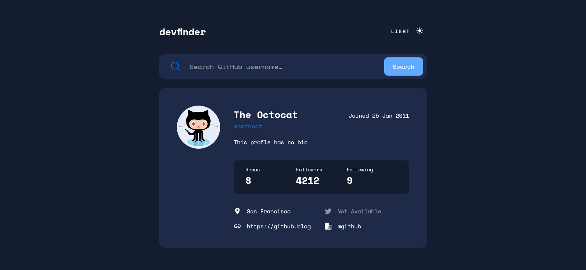

# Frontend Mentor - GitHub user search app solution

This is a solution to the [GitHub user search app challenge on Frontend Mentor](https://www.frontendmentor.io/challenges/github-user-search-app-Q09YOgaH6). Frontend Mentor challenges help you improve your coding skills by building realistic projects.

## Table of contents

- [Overview](#overview)
  - [The challenge](#the-challenge)
  - [Screenshot](#screenshot)
  - [Links](#links)
- [My process](#my-process)
  - [Built with](#built-with)
  - [What I learned](#what-i-learned)
  - [Continued development](#continued-development)
  - [Useful resources](#useful-resources)
- [Author](#author)

## Overview

### The challenge

Users should be able to:

- View the optimal layout for the app depending on their device's screen size
- See hover states for all interactive elements on the page
- Search for GitHub users by their username
- See relevant user information based on their search
- Switch between light and dark themes
- **Bonus**: Have the correct color scheme chosen for them based on their computer preferences. _Hint_: Research `prefers-color-scheme` in CSS.

### Screenshot

### Links

- Solution URL: [Add solution URL here](https://your-solution-url.com)
- Live Site URL: [Add live site URL here](https://your-live-site-url.com)

## My process

### Built with

- Semantic HTML5 markup
- CSS Grid
- Mobile-first workflow
- [Typescript](https://www.typescriptlang.org/) - Syntactical superset of JavaScript
- [React](https://reactjs.org/) - JS library
- [Next.js](https://nextjs.org/) - React framework
- [Styled Components](https://styled-components.com/) - For styles
- [Axios](https://axios-http.com/) - Http Client
- [Nookies](https://github.com/maticzav/nookies) - A collection of cookie helpers for Next.js
- [date-fns](https://date-fns.org/) - Date lib

### What I learned

In this project I could learn a lot about using `typescript` in practice, in addition to a more complex setup of the project using tools such as `husk`, `lint-staged`, `eslint` and `prettier`.

### Continued development

I want to continue focusing on the study of `typescript` and the best patterns to develop with it, and I also want to start studying `unit tests` with `Jest`.

### Useful resources

- [NextJS Docs](https://nextjs.org/docs/getting-started)
- [Styled Components Docs](https://styled-components.com/docs)
- [Typescript Handbook](https://www.typescriptlang.org/docs/handbook/intro.html)

## Author

- Website - [João Pedro Sanchez](https://github.com/jpdrsanchez)
- Frontend Mentor - [@jpdrsanchez](https://www.frontendmentor.io/profile/jpdrsanchez)
- Twitter - [@jpdrsanchez](https://twitter.com/jpdrsanchez)
